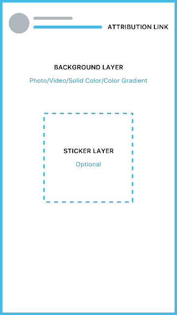

# Instagram Story Sharer
Instagram Story Sharer contains the code for share image to Instagram Stories.



The background can be an image, video, gradient or color (same color for the top and the bottom of the gradient).
The sticker is an image, the methods accept String with the image name, UIImage and image data as Data.
The contentUrl is the attribution link, this link only appears if your app is aproved by Instagram to use attribution links.
The color can be a UIColor or the hex value for the color.

## Usage

The code contains methods for sharing the following contents:
+ Background image and sticker image
```swift
func shareToInstagramStories(backgroundImage:Any, stickerImage:Any, contentUrl:String?) -> NSError?     
```
+ Background video and sticker image
```swift
func shareToInstagramStories(backgroundVideoName:String, backgroundVideoExtension:String, stickerImage:Any, contentUrl:String?) -> NSError?    
```
+ Background gradient and sticker image
```swift
func shareToInstagramStories(topColor:UIColor, bottomColor:UIColor, stickerImage:Any, contentUrl:String?) -> NSError?
func shareToInstagramStories(topColorHexString:String, bottomColorHexString:String, stickerImage:Any, contentUrl:String?) -> NSError?    
```

## Tools
The code as an extension of UIColor to obtain the hex string to use in the background gradient methods
```swift
    var hex: String
```

Also there is other extension to obtain a view as image and use it as a sticker
```swift
   func asImage() -> UIImage
```